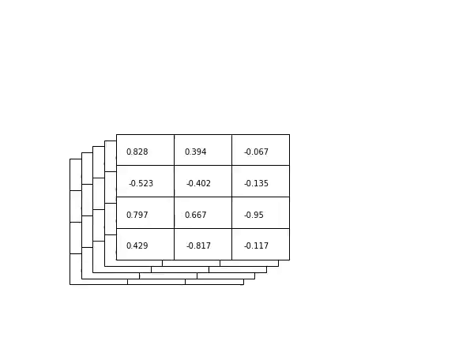

# mathimation

Python scripts to animate matrix operations for educational purpose in deep learning.

## Example

The demo script provides an example of a matrix batch moving across the screen.

After cloning the repository and changing directories, run the following command in Terminal:

```
python demo.py
```

It should produce an MP4 video that looks like this:


